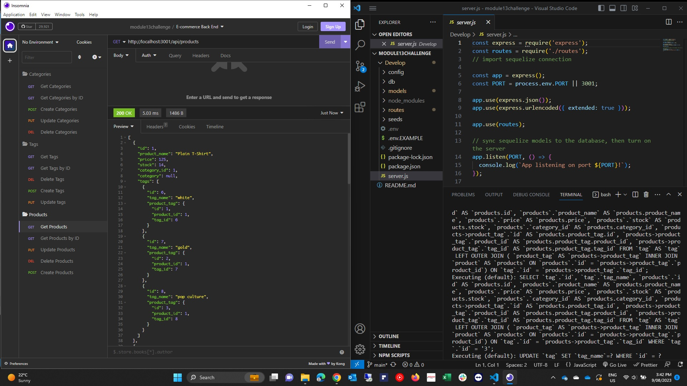

# Module 13 Challenge

# Object-Relational Mapping (ORM) Challenge: E-commerce Back End

## Description

Internet retail, also known as e-commerce, is the largest sector of the electronics industry, having generated an estimated US$29 trillion in 2017 (Source: United Nations Conference on Trade and Development). E-commerce platforms like Shopify and WooCommerce provide a suite of services to businesses of all sizes. Due to the prevalence of these platforms, developers should understand the fundamental architecture of e-commerce sites.

The challenge is to build the back end for an e-commerce site. You’ll take a working Express.js API and configure it to use Sequelize to interact with a MySQL database.

## User Story

- AS A manager at an internet retail company
- I WANT a back end for my e-commerce website that uses the latest technologies
- SO THAT my company can compete with other e-commerce companies

## Criteria

- GIVEN a functional Express.js API
- WHEN I add my database name, MySQL username, and MySQL password to an environment variable file
- THEN I am able to connect to a database using Sequelize
- WHEN I enter schema and seed commands
- THEN a development database is created and is seeded with test data
- WHEN I enter the command to invoke the application
- THEN my server is started and the Sequelize models are synced to the MySQL database
- WHEN I open API GET routes in Insomnia Core for categories, products, or tags
- THEN the data for each of these routes is displayed in a formatted JSON
- WHEN I test API POST, PUT, and DELETE routes in Insomnia Core
- THEN I am able to successfully create, update, and delete data in my database
- Uses the MySQL2Links to an external site. and SequelizeLinks to an external site. packages to connect to a MySQL database.
- Uses the dotenv packageLinks to an external site. to use environment variables to store sensitive data, like a user’s MySQL username, password, and database name.
- Syncs Sequelize models to a MySQL database on the server start.
- Includes column definitions for all four models outlined in the Challenge instructions.
- Includes model associations outlined in the Challenge instructions.

## Installation

- Navigate to the develop folder using the command prompt
- npm init -y
- npm i mysql2
- npm i sequelize
- npm i dotenv

## Usage

- Copy .env.EXAMPLE, Paste and rename to .env
- In .env enter database name, username and your password
- Run mysql -u root -p
- Enter Password
- Run source db/schema.sql
- Quit from mysql
- Run index.js inside Seeds folder
- Run npm start
- Open Insomnia
- To end your server in your command prompt type: Ctrl + c

## Contributing

csetiawan88 - https://github.com/csetiawan88/

## Walkthrough Video

Video created with Screencastify.

Video Link:

## Screenshot

## Technologies

- [MySQL](https://www.mysql.com/)
- [Express.js](https://expressjs.com/)
- [Node.js](https://nodejs.org/en/)
- [npmjs](https://docs.npmjs.com/)
- [inquirer](https://www.npmjs.com/package/inquirer)
- Sequelize ORM
- dotenv

## Github

GITHUB: https://github.com/csetiawan88/ecommercebackend

## Questions

If you have any additional questions, you can reach me at:
csetiawan@yahoo.com
